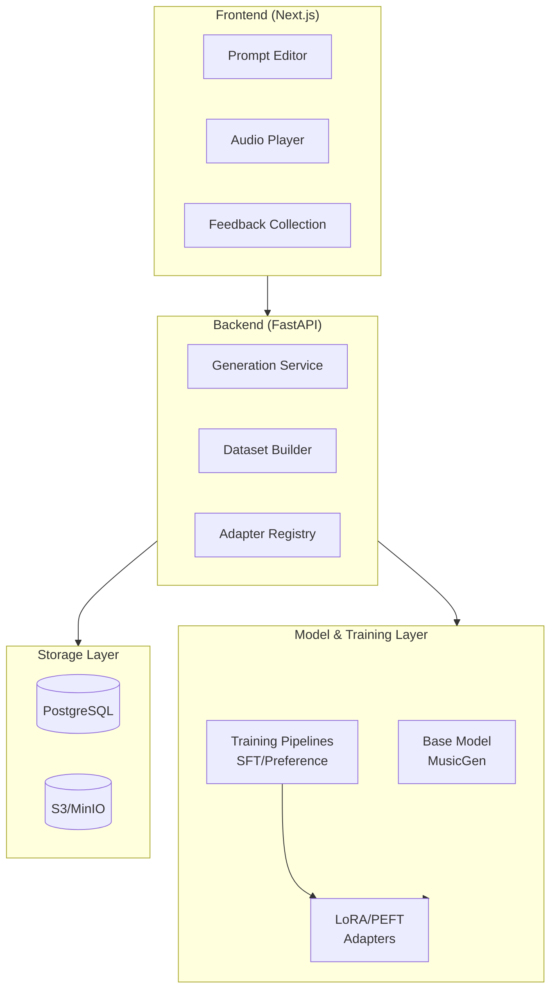
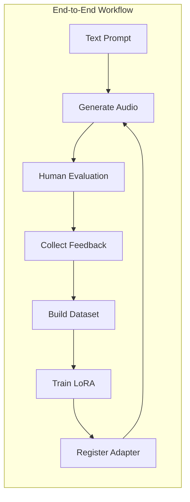

<p align="center">
  
</p>

# Text2Song Studio

[](LICENSE)
[](https://www.python.org/downloads/)
[](https://nodejs.org/)
[](https://www.docker.com/)
[](CONTRIBUTING.md)

An open-source, human-in-the-loop text-to-music generation platform designed for iterative model improvement, controllable music generation, and preference-driven training workflows.

## Table of Contents

- [Overview](#overview)
- [Features](#features)
- [System Architecture](#system-architecture)
- [Technology Stack](#technology-stack)
- [Getting Started](#getting-started)
- [Configuration](#configuration)
- [API Reference](#api-reference)
- [Development](#development)
- [Testing](#testing)
- [Deployment](#deployment)
- [Contributing](#contributing)
- [Roadmap](#roadmap)
- [FAQ](#faq)
- [License](#license)

## Overview

Text2Song Studio treats text-to-music generation as a full lifecycle system rather than a one-shot task. The platform connects prompt design, music generation, human evaluation, dataset construction, and parameter-efficient fine-tuning, enabling music generation models to continuously evolve based on structured human feedback.

## Features

- **Prompt Editor**: Natural language and structured musical attributes (style, tempo, instrumentation, mood)
- **Multi-Sample Generation**: Side-by-side audio comparison with waveform visualization
- **Human Feedback Collection**: Rating, A/B preference selection, qualitative tags and annotations
- **LoRA Adapter Management**: Select and manage adapters during inference
- **Dataset Construction**: Build supervised and preference-ranking training datasets from feedback
- **Parameter-Efficient Fine-Tuning**: Train LoRA adapters without full model retraining

## System Architecture





## Technology Stack

| Layer | Technologies |
|-------|-------------|
| Frontend | React, Next.js, Tailwind CSS, shadcn/ui, wavesurfer.js |
| Backend | FastAPI (Python), PyTorch, torchaudio, librosa |
| Model | Meta MusicGen, PEFT/LoRA |
| Storage | PostgreSQL (metadata), S3-compatible object storage (audio) |

## End-to-End Workflow

1. Users submit a textual description of desired music (style, mood, structure, instrumentation)
2. The system generates multiple candidate audio samples using a selected base model and optional LoRA adapters
3. Users listen, compare, and evaluate generated outputs via structured feedback interfaces
4. The system records (prompt, audio, score, preference, tags) tuples
5. Feedback data is transformed into supervised or preference-ranking training datasets
6. LoRA adapters are trained or updated using parameter-efficient fine-tuning
7. Newly trained adapters are registered and can be immediately applied during inference
8. The system continuously improves through repeated human-model interaction cycles

## Getting Started

### Prerequisites

- Docker and Docker Compose
- Python 3.10+
- Node.js 18+

### Installation

1. Clone the repository:

```bash
git clone https://github.com/yen0304/Text2SongStudio.git
cd text2song-studio
```

2. Start services with Docker Compose:

```bash
docker-compose up -d
```

3. Access the application:
   - Frontend: http://localhost:3000
   - Backend API: http://localhost:8000
   - API Documentation: http://localhost:8000/docs

### Development Setup

**Backend:**

```bash
cd backend
python -m venv venv
source venv/bin/activate
pip install -r requirements.txt
uvicorn app.main:app --reload
```

**Frontend:**

```bash
cd frontend
npm install
npm run dev
```

## Configuration

### Environment Variables

Create a `.env` file in the project root or set the following environment variables:

**Backend:**

| Variable | Description | Default |
|----------|-------------|---------|
| `DATABASE_URL` | PostgreSQL connection string | `postgresql://localhost/text2song` |
| `STORAGE_TYPE` | Storage backend (`local` or `s3`) | `local` |
| `STORAGE_PATH` | Local storage path for audio files | `./storage` |
| `S3_BUCKET` | S3 bucket name (if using S3) | - |
| `S3_ENDPOINT` | S3 endpoint URL (for MinIO) | - |
| `MODEL_CACHE_DIR` | Directory for cached model files | `./model_cache` |
| `DEFAULT_MODEL` | Default MusicGen model variant | `facebook/musicgen-small` |

**Frontend:**

| Variable | Description | Default |
|----------|-------------|---------|
| `NEXT_PUBLIC_API_URL` | Backend API URL | `http://localhost:8000` |

### Model Configuration

The system supports multiple MusicGen model variants:

- `facebook/musicgen-small` - 300M parameters, faster inference
- `facebook/musicgen-medium` - 1.5B parameters, balanced
- `facebook/musicgen-large` - 3.3B parameters, highest quality

## Project Structure

```
text2SongStdio/
├── backend/                 # FastAPI backend service
│   ├── app/
│   │   ├── models/          # Database models
│   │   ├── routers/         # API endpoints
│   │   ├── schemas/         # Pydantic schemas
│   │   └── services/        # Business logic
│   └── model_cache/         # Cached model files
├── frontend/                # Next.js frontend application
│   └── src/
│       ├── app/             # Next.js app router
│       ├── components/      # React components
│       └── lib/             # Utilities and API client
├── model/                   # Training scripts and configuration
│   └── training/
│       ├── cli.py           # Training CLI
│       ├── config.py        # Training configuration
│       ├── preference.py    # Preference-based training
│       └── supervised.py    # Supervised fine-tuning
└── openspec/                # Project specifications and proposals
```

## API Reference

The backend exposes a RESTful API. Key endpoints include:

| Endpoint | Method | Description |
|----------|--------|-------------|
| `/api/prompts` | GET, POST | Manage generation prompts |
| `/api/generation` | POST | Generate audio samples |
| `/api/audio` | GET | Retrieve generated audio |
| `/api/feedback` | POST | Submit human feedback |
| `/api/datasets` | GET, POST | Manage training datasets |
| `/api/adapters` | GET, POST | Manage LoRA adapters |
| `/health` | GET | Health check |

Full API documentation is available at `/docs` when the backend is running.

## Development

### Code Style

- **Python**: Follow PEP 8. Use `black` for formatting and `ruff` for linting.
- **TypeScript**: Follow ESLint configuration. Use Prettier for formatting.

```bash
# Backend formatting and linting
cd backend
black .
ruff check .

# Frontend formatting and linting
cd frontend
npm run lint
npm run format
```

### Branch Naming Convention

- `feature/` - New features (e.g., `feature/add-audio-export`)
- `fix/` - Bug fixes (e.g., `fix/audio-playback-issue`)
- `docs/` - Documentation updates (e.g., `docs/update-api-reference`)
- `refactor/` - Code refactoring (e.g., `refactor/generation-service`)
- `test/` - Test additions or updates (e.g., `test/add-feedback-tests`)

### Commit Message Convention

Follow [Conventional Commits](https://www.conventionalcommits.org/):

```
<type>(<scope>): <description>

[optional body]

[optional footer]
```

Types: `feat`, `fix`, `docs`, `style`, `refactor`, `test`, `chore`

Examples:
```
feat(generation): add support for multiple LoRA adapters
fix(audio): resolve playback issue on Safari
docs(readme): update installation instructions
```

## Testing

### Backend Tests

```bash
cd backend
pytest
pytest --cov=app --cov-report=html  # With coverage
```

### Frontend Tests

```bash
cd frontend
npm run test
npm run test:coverage  # With coverage
```

### End-to-End Tests

```bash
npm run test:e2e
```

## Deployment

### Docker Deployment

```bash
# Build and start all services
docker-compose up -d --build

# View logs
docker-compose logs -f

# Stop services
docker-compose down
```

### Production Deployment

For production deployments, consider the following:

1. **Use a reverse proxy** (nginx, Traefik) for SSL termination
2. **Configure proper database** with connection pooling
3. **Set up object storage** (S3, MinIO) for audio files
4. **Enable monitoring** with Prometheus/Grafana
5. **Configure backup** for database and audio assets

Example production docker-compose override:

```yaml
# docker-compose.prod.yml
version: '3.8'
services:
  backend:
    environment:
      - DATABASE_URL=postgresql://user:pass@db:5432/text2song
      - STORAGE_TYPE=s3
      - S3_BUCKET=text2song-audio
    restart: always
  
  frontend:
    environment:
      - NEXT_PUBLIC_API_URL=https://api.yourdomain.com
    restart: always
```

## Design Principles

- **Human-in-the-loop by design**: Human judgment is a core training signal, not an afterthought
- **Adapter-centric learning**: Musical preferences and styles are encoded as modular LoRA adapters rather than full model retraining
- **Model decoupling**: The platform orchestrates models but does not depend on any single architecture or provider
- **Reproducible and open**: All stages from generation to training are transparent and reproducible

## Use Cases

- Research on controllable and preference-aligned music generation
- Collaborative dataset creation for music AI
- Experimentation with human feedback-driven audio models
- Long-term evolution of stylistic or domain-specific music generators

## Contributing

Contributions are welcome. Please read the guidelines below before submitting pull requests.

### How to Contribute

1. **Fork** the repository
2. **Clone** your fork locally
3. **Create a branch** for your changes (`git checkout -b feature/your-feature`)
4. **Make changes** and commit with clear messages
5. **Push** to your fork (`git push origin feature/your-feature`)
6. **Open a Pull Request** against the `main` branch

### Pull Request Guidelines

- Provide a clear description of the changes
- Reference related issues (e.g., `Fixes #123`)
- Ensure all tests pass
- Update documentation if needed
- Follow the code style guidelines
- Keep PRs focused on a single concern

### Pull Request Template

When opening a PR, include:

```markdown
## Description
Brief description of changes

## Type of Change
- [ ] Bug fix
- [ ] New feature
- [ ] Breaking change
- [ ] Documentation update

## Related Issues
Fixes #(issue number)

## Checklist
- [ ] Tests added/updated
- [ ] Documentation updated
- [ ] Code follows style guidelines
- [ ] All tests pass
```

### Reporting Issues

When reporting bugs, include:

- Clear description of the issue
- Steps to reproduce
- Expected vs actual behavior
- Environment details (OS, Python version, Node.js version)
- Relevant logs or screenshots

### Feature Requests

For feature requests, please:

- Check existing issues to avoid duplicates
- Describe the use case and expected behavior
- Explain why this feature would be useful

## Roadmap

- [ ] WebSocket support for real-time generation progress
- [ ] Batch generation and export
- [ ] Audio editing and trimming
- [ ] Prompt templates and presets
- [ ] Multi-user collaboration
- [ ] Model comparison dashboard
- [ ] Integration with external audio DAWs
- [ ] API rate limiting and quotas
- [ ] Distributed training support

## FAQ

**Q: What GPU is required for running the model?**

A: For `musicgen-small`, 8GB VRAM is sufficient. For `musicgen-large`, 24GB+ VRAM is recommended. CPU-only inference is supported but significantly slower.

**Q: Can I use my own trained models?**

A: Yes. The system supports any HuggingFace-compatible MusicGen model. Set the `DEFAULT_MODEL` environment variable to your model path.

**Q: How do I export training datasets?**

A: Use the `/api/datasets/{id}/export` endpoint or the "Export" button in the dataset management UI.

**Q: Is commercial use allowed?**

A: This project is open source. However, be aware of the licensing terms of the underlying models (e.g., MusicGen) which may have separate restrictions.

## License

This project is licensed under the MIT License. See the [LICENSE](LICENSE) file for details.

## Acknowledgments

- [Meta MusicGen](https://github.com/facebookresearch/audiocraft) for the base text-to-music model
- [PEFT](https://github.com/huggingface/peft) for parameter-efficient fine-tuning utilities
- [FastAPI](https://fastapi.tiangolo.com/) for the backend framework
- [Next.js](https://nextjs.org/) for the frontend framework
- [shadcn/ui](https://ui.shadcn.com/) for UI components
- [wavesurfer.js](https://wavesurfer-js.org/) for audio waveform visualization

## Contact

- **Issues**: [GitHub Issues](https://github.com/yen0304/Text2SongStudio/issues)
- **Discussions**: [GitHub Discussions](https://github.com/yen0304/Text2SongStudio/discussions)

## Star History

[](https://star-history.com/#yen0304/Text2SongStudio&Date)

---

If you find this project useful, please consider giving it a star ⭐ on GitHub!
